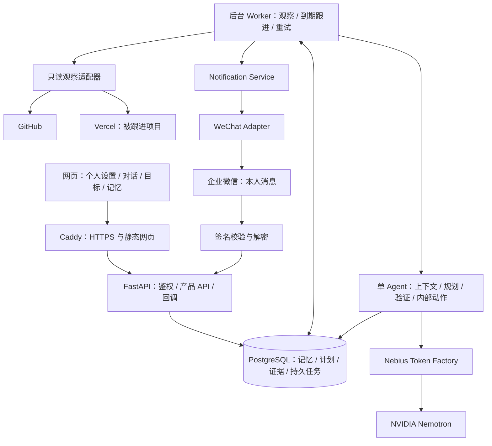

> 开发基线：用户已于 2026-09-30 明确同意整套方案并授权开始开发。正文中的规划阶段/待确认说明保留为历史背景；外部账户与接口验证仍需实测。

# Qianyan — Technical Spec

依据新版 Scope 和 PRD。本文件定义可实施的推荐架构；尚未开始编码、配置账户或部署。技术选型与默认值待用户统一确认。旧 DecisionPatch 文档已移到 archive，不用于当前实现。

## How This Works, In Plain Language

Qianyan 的网页让你设定自己的管家、交代目标和查看计划。一台持续在线的云服务器保存你的设置、记忆和任务；一个独立的后台进程在你关闭网页后继续检查该跟进的事。它把需要理解的目标、相关记忆和最新事实发给 Nebius 上的 Nemotron，让模型提出计划；后端按完成标准和权限检查后，才真正更新内部任务。

微信通知由独立通知层发送。先使用企业微信官方自建应用，回复回到同一个目标空间。GitHub 和 Vercel 是可插入的数据源：接入后能自动发现数字进展，没有接入的生活目标由内部状态和用户补充推进。数据库保存真实结果，聊天摘要只是辅助理解，不能替代事实。

首版运行自己的后台服务，不在云端租 GPU 或自己部署大模型。Docker 容器用于部署自己的程序；首版不运行用户仓库代码，不提供任意 shell 工具。

## Architecture Overview



推荐部署：**腾讯云香港或新加坡 CPU 云服务器**，固定公网 IPv4；Caddy、API、Worker、PostgreSQL 四个容器。React 构建后的静态文件由 Caddy 提供。选择境外地域是减少本次 Demo 的网站备案等待与跨境 API 接入配置，具体可购买地域、价格和网络质量开发前核验。[服务器网络概念](https://cloud.tencent.cn/document/product/1207/79254)、[腾讯云备案说明](https://cloud.tencent.com/document/product/243/19630/)

## The Core Journey Through the System

实现 `prd.md > The Core Journey`。

1. 网页保存个人设置 → API 验证 → PostgreSQL。Worker 下一次工作读取最新版本。
2. 用户发目标 → API 记录消息并创建持久 job → Worker 检索相关记忆 → Token Factory/Nemotron 提议计划 → schema、日期和依赖验证 → 网页显示待确认计划。
3. 确认初始计划 → 原子保存目标/任务 → 安排第一次观察与跟进。无外部数据源也能使用底座。
4. 周期观察 → 只读适配器获取事实 → 标准化 Evidence 和版本 → 确定性完成规则 → 必要时调用 Nemotron 提议重排。
5. 验证后的 PlanPatch 在事务中提交，记录计划前后变化、理由、证据和下次跟进；同一事务写入通知待发送记录。
6. Worker 按联系窗口、通知类型、去重规则投递企业微信；不会因为网页关闭停止。
7. 回复回调校验/解密 → 绑定本人空间 → 保存用户证据/意图 → 重新规划。手机详情页操作走同一 API 和权限。
8. 第二天网页读取数据库的当前快照、摘要及证据；不依赖浏览器 localStorage 作为长期记忆。

## Stack

以下是推荐，不是用户已选定的栈。目标 Python 3.12、Node.js 22（满足实际 Vite 要求的补丁版）、PostgreSQL 16；正式开发时锁定依赖版本并生成 lock 文件。本次没有安装依赖。

| 层 | 推荐 | 选择理由与文档 |
|---|---|---|
| Frontend | React + TypeScript + Vite；CSS | 静态构建简单；无需为本次工作台引入 SSR。[React](https://react.dev/learn)、[Vite](https://vite.dev/guide/)、[TypeScript](https://www.typescriptlang.org/docs/) |
| Backend | Python / FastAPI / Pydantic | 统一 API、输入校验和回调。[FastAPI](https://fastapi.tiangolo.com/)、[Pydantic](https://docs.pydantic.dev/latest/) |
| 外部请求 | HTTPX | 网络超时、统一适配器、Token Factory 请求。[HTTPX](https://www.python-httpx.org/) |
| 数据 | PostgreSQL + SQLAlchemy + Alembic | 支持 API/Worker 并发、事务和数据迁移。[PostgreSQL](https://www.postgresql.org/docs/16/)、[SQLAlchemy](https://docs.sqlalchemy.org/)、[Alembic](https://alembic.sqlalchemy.org/) |
| Agent | Python 显式状态机 + 工具注册表 | 单 Agent 足够；模型负责理解和规划，后端负责核验与执行 |
| AI | Token Factory 上的 Nemotron 3 Super | 实际参与目标拆解、上下文更新与下一步规划。[官方可用性](https://nebius.com/blog/posts/nemotron3-super-now-available) |
| 后台调度 | 独立 Worker + PostgreSQL 持久任务表 | 重启可恢复，不增加 Redis/Celery 服务 |
| 通知 | Notification Service + WeCom adapter | 与未来微信/其他入口解耦。[腾讯官方接入指引](https://cloud.tencent.com/document/product/213/130517) |
| 部署 | Docker Compose + Caddy + CPU VM | 固定出口 IP、持续进程、同域网页/API。[Docker Compose](https://docs.docker.com/compose/)、[Caddy](https://caddyserver.com/docs/) |
| 验证 | pytest；少量端到端浏览器验收 | 针对证据误判、重复事件、权限与后台恢复；不追求无意义覆盖率。[pytest](https://docs.pytest.org/) |

### Why This Deployment

企业微信自建应用的官方指引要求可信 IP。单台 VM 能将出口 IP 和回调地址管理在一处。Railway Pro 是降低运维的备选；固定出口 IP 当前在 Pro 可用、基础费每月 20 美元，资源用量另按账单核算。[固定出口](https://docs.railway.com/networking/static-outbound-ips)、[计划价格](https://docs.railway.com/pricing/plans)

Vercel 非无限运行进程的宿主；可以设计定时函数方案，但函数时限、调度、重试和出口 IP 增加本项目配置。本次推荐常驻 Worker。[函数限制](https://vercel.com/docs/functions/limitations)、[Cron 管理](https://vercel.com/docs/cron-jobs/manage-cron-jobs)

通过运行时 Token Factory 调用 Nemotron满足比赛技术要求；应用网页不强制和模型同一云供应商。若用户已有 Nebius Compute 资源，可用同样容器迁移到 Nebius，但本次未核验其账户可购 CPU 规格和价格，不把免费可用视为事实。

## Frontend

实现 `prd.md > Screens`、F1–F5、F8–F9。

- 组件：ButlerSettings、GoalList、GoalPlan、Chat、PlanUpdateCard、EvidenceDrawer、MemoryPanel、Inbox、NotificationAction。
- `/` 当前事项与对话；`/goals/:id` 详情；`/memory`；`/settings`；`/inbox`；`/n/:id` 手机通知详情；`/demo` 隔离样例。
- 简单请求轮询 run/job 状态，活动页面约两秒；数据源观察独立五分钟。网页关闭不会取消 job。
- 初次请求立即回 `run_id` 和 pending，显示真实步骤状态；不生成假的打字进展。不为主流程增加 WebSocket。
- 本地只保存 UI 临时状态。个人设置、计划、消息、记忆都由 API/数据库管理。
- 中文/英文标签及样例通过简单字典管理；来源链接、时间、Unknown 标签和动作结果不只依赖颜色。

## Backend and Access Control

实现 F1–F4、F8–F9。

API 负责认证、空间隔离、输入校验、读写产品状态与排队。所有任务/记忆/通知查询都按服务端确定的 `space_id` 限定；不信任用户提交的空间 ID。

本人使用单账户登录：部署时环境配置密码散列，登录限速，HttpOnly/Secure/SameSite cookie 对应数据库 session。变更 API 校验 CSRF 与 Origin。无需注册、邮箱验证或账号找回系统。

公共 Demo 服务端建立有限存活的匿名 demo session，独立 space，禁止企业微信发送/连接真实个人数据源/读取本人空间。Demo 请求限速和总预算约束。本人 cookie 与 Demo cookie 分开，后端逐项验证角色。

手机通知详情默认要求本人登录；若后续采用免登录动作链接，必须使用只对应一个通知动作的短期单次 token，不能扩展为整个账户访问。首版无需做 OAuth/JSSDK 登录，减少可信域名接入要求；消息外链可打开性仍需实际手机核验。

## Agent Architecture

实现 F2、F4、F5。

### Single Agent Runtime

流程：**Load context → Observe/Read → Evaluate evidence → Plan → Validate → Commit internal actions → Schedule/Notify → Remember**。

不是多个 Agent 相互协作；这些是一个受限 Agent 的阶段。Worker 触发运行，模型只在理解目标、判断下一步或解释变化时调用。确定性同步/无变化不产生模型调用。

### Context Builder

取当前个人设置、目标、当前计划、适用的有效记忆、最新相关 Evidence、尚未回答的问题、少量最近消息。按关联目标和类型检索；首版不做向量数据库。输入裁剪有标记，不让摘要改写客观证据。

指令、用户意图、外部内容分开。README 和日志是待分析数据；它们不能授予工具权限、要求泄露凭据或扩大观察范围。

### Model Tasks and Reusable Skills

固定可复用能力：capture_goal、propose_plan、review_progress、plan_next_action、draft_followup、summarize_context；首条连接器能力 read_github_progress、read_deployment_progress。

“Skill”在本项目是带输入/输出规则的模块和提示模板，不是任意下载执行的插件。模型用工具读取已有事实与计划；写入操作形成受检验的 PlanPatch。权限硬约束由后端实现。

### Tools and Boundaries

允许模型提出：get_goal、list_tasks、read_evidence、read_memory、propose_plan_patch、propose_followup。业务执行层再更新内部状态、创建下一步、排序、安排跟进。本人通知只能经通知策略且发送给绑定收件人。

没有任意 URL fetch、shell、代码写入、部署、邮件、付款等工具。连接器调用由后端固定方法和绑定项目控制。Agent 名称/人格/偏好不能覆盖这些限制。

建议每次最多四轮工具调用、最多两次规划生成、总运行时限 120 秒。耗时达到上限后保留事实与旧计划并报告需重试，不无限自循环。

### PlanPatch Contract and Validation

候选字段：goal_id、base_plan_version、evidence_ids、changes、reason、next_action、followup_at、notification_candidate。

每个 change 包含 task_id 或新任务标识、操作、前后值和依据；允许状态更新、建下一步、优先级、依赖、内部提醒时间。验证：

1. 空间/目标/证据匹配；来源有效、版本仍适用。
2. Done 必须对应确定性 criterion result 或用户确认；模型文本不能自证。
3. 依赖无环；提醒时间有时区；硬 deadline 不由模型改写。
4. task 数量/操作权限/字段长度有界；相同阻塞下一步不重复创建。
5. `base_plan_version` 仍等于数据库版本；不一致则读取新状态重新规划。

成功提交：计划版本加一、记录变化、持久 job、通知 outbox 同一事务。无效候选不给任务写入，最多一次带校验错误重试，仍失败保持旧计划。用户撤销最近一次更新产生新的计划版本，保留原 Evidence 与变化历史；随后重新核对事实，不删除事实来制造“撤销成功”。

## Persistent Memory

实现 F1、F3、F4。

三层：个人设置/明确偏好，目标与当前计划，历史事实/决定/跟进。事实有来源和版本，推测留在候选而不写用户事实。摘要可更新但不拥有状态权威。

每条记忆包含 kind、内容、origin_record_id、goal_id（可空）、有效状态、时间、替代关系。编辑采用新版本，旧版本不进入当前上下文。显式遗忘清除该记忆正文、来源对话中相关记录及派生摘要；令上下文缓存失效。历史运行不保存完整私人原始 prompt/response，以减少遗忘后仍被旧日志引用的问题。

导出个人空间的设置、有效记忆、目标/任务和证据；不给出凭据/session。MVP 提供 JSON 下载。服务器数据由用户控制，但选定上下文会发给 Token Factory：不能宣称所有数据绝不离开服务器；仅发送当前任务需要的片段。数据留存或零留存能力按实际账户设置核验，不假定已开启。

## Repository Understanding

实现 F6。只理解进度有关的仓库切片：元信息、目标分支 SHA、指定目录、README、变更文件列表、指定 CI。没有 clone 全仓库、代码 embedding、架构重建或代码执行。

建议单次最多读取 README 64 KiB、目录/变更文件 100 项；超限明确标记 partial，不凭部分读取证明全部完成。以文件 SHA 和 commit SHA 保持 Evidence 可追溯。README 用 Markdown parser 检查预定义结构，模型可解释缺项，不能越过结构校验。

指定 CI workflow 与分支、head_sha 对齐；`completed + success` 才记对应运行通过，`skipped/cancelled/pending` 不计。它只说明该 workflow 结果；未读取配置/没有测试步骤证据时用“CI 通过”而非“测试已全面通过”。

## Code Execution / Sandbox

当前产品不自主改代码或运行用户仓库，所以 **MVP 不集成任意代码执行 Sandbox**。自己的服务以低权限容器运行，与将不可信代码放入隔离沙箱是不同能力。

如下一阶段需要“生成修复方案后运行检查”，再接 Nebius Token Factory Sandboxes/Contree，并设计仓库/命令 allowlist、网络限制、超时、资源限额、无用户密钥和结果 Evidence。账户端点与额度在接入前核验。[Sandbox 官方文档](https://docs.tokenfactory.nebius.com/sandboxes/overview)

原初 Coding Agent 的 Plan → Code → Run → Test → Fix 不作为本次 MVP；当前用户确认的核心是个人管家目标闭环。

## Nebius Token Factory and NVIDIA Nemotron

实现 F2、F5。采用 HTTPS 直接请求或其兼容客户端；本方案用 HTTPX 以减少 SDK 依赖。

- `GET https://api.tokenfactory.nebius.com/v1/models`：Bearer key，读取 `data[].id`，确认账户可用的精确 NVIDIA model_id。[模型列表](https://docs.tokenfactory.nebius.com/api-reference/models/list-models)
- `POST https://api.tokenfactory.nebius.com/v1/chat/completions`：Bearer key，payload 为 model、messages、必要 tools/tool_choice；返回 choices/message/tool_calls、usage（若提供）。[Quickstart](https://docs.tokenfactory.nebius.com/quickstart)
- 官方示例使用 `nvidia/nemotron-3-super-120b-a12b`；仅作为候选，实际以对应端点 `/models` 与账户可用值为准，使用 `NEBIUS_MODEL_ID` 配置。[Nemotron 官方示例](https://nebius.com/services/token-factory/nemotron)
- 初版只选一个可用 Nemotron 模型；无需同时接 Ultra/Nano。目标拆解、计划变更、跟进解释都真实参与使用，不仅拿模型生成欢迎语。
- 输出优先使用支持的 JSON/schema 模式或 function calling；是否支持当前模型须实测。不支持严格 schema 时校验普通 JSON/工具参数，失败重试一次。[工具调用](https://docs.tokenfactory.nebius.com/ai-models-inference/function-calling)、[结构化输出](https://docs.tokenfactory.nebius.com/ai-models-inference/json)
- 网络超时、429、5xx 有限退避；记录请求时间、模型、token usage 和验证结果，不记录 key/完整私人上下文。401/403 停止该模型调用并展示配置失败。
- 定价与限流以账户当前目录/响应为准。MVP 每个有变化的事件通常一至两次模型调用；无变化轮询零调用。每空间、每天、全实例设调用与 token 上限，超过时暂停 AI 规划而不伪造结果。

## Database

实现 F1–F5、F8–F9。PostgreSQL 同 VM、私有容器网络，持久 volume；外部不开放 5432。所有 UTC 时间用带时区类型，用户时区用于展示与通知窗转换。

| 表 | 关键字段 | 更新与保存规则 |
|---|---|---|
| spaces | id、owner/demo、settings JSONB、source_bindings、expires_at | 设置最新版本；绑定参数不含密钥；Demo 自动过期 |
| sessions | id、space_id、token_hash、expiry、role | 登录/匿名访问建立；登出/过期撤销 |
| goals | space_id、title、intent、deadline、status、plan_version、capacity | 用户确认/更新；硬期限用户控制 |
| tasks | goal_id、title、status、priority、depends_on、criteria JSONB、estimate、followup_at | 原子 PlanPatch 或用户更新；依赖 ID 验证无环 |
| records | space_id、goal_id/task_id、kind、body JSONB、source、source_id、version、observed_at、source_updated_at、active | kind 为 message/memory/evidence/summary/decision；按源版本去重；遗忘正文清理 |
| runs | goal_id、trigger、status、base_version、patch、metrics、error | 记录计划差异、有限诊断指标，不存完整私人模型请求 |
| jobs | space_id、goal_id、kind、due_at、payload、dedup_key、lease_until、attempts、status | 持久调度、重启恢复；payload 引用记录 ID |
| notifications | space_id、goal_id、category、reason_key、body、due_at、send_state、provider_id、action_state | 同时作为 outbox/收件箱；动作一次消费；待投递时复查是否仍有效 |

键规则：外部 Evidence `(space, source, source_id, version, fact_kind)` 唯一；jobs 的有效 dedup_key 唯一；通知 reason_key 包含事件/阻塞版本。同一源重复抓取仅更新 last_seen，不形成新进度。

使用事务和 plan_version 避免用户操作被后台旧计划覆盖。API/Worker 共享库，不靠内存字典长期保存状态。初版 SQLAlchemy 普通事务即可，不做事件溯源基础设施；records 保留必要事实历史。

## Worker and Durable Scheduling

实现 F5、F8。

- 独立进程每约三十秒检查 jobs。一次只领取适量任务，事务行锁配合 lease；任务处理中宕机，lease 到期可重新领取。
- GitHub/Vercel 默认五分钟轮询；没有连接器时只处理内部到期跟进。源有限重试后降低频率并标 unavailable；新事实与到期行动才调用 Agent。
- 任一 job 可被重复执行，内部效果按 dedup_key 幂等；发送通知存在网络不确定性，不能保证对外“恰好一次”。平台响应超时记录 unknown delivery，避免立刻无限重发；有限重试需复用发送标识并展示可能重复。
- 跟进 due_at 和联系窗口取较晚可用时刻；发送前检查目标仍活动、原阻塞仍存在、用户未暂停或已处理，撤销过时通知。
- 后台写 heartbeat；`/health/ready` 判断数据库、Worker 新鲜度与配置，网页显示最后运行时间。目标完成后停止周期任务。

## Notification Service and WeChat Adapter

实现 F8。渠道接口：send(notification, recipient) → accepted/provider_id/error；verify_and_parse_callback → normalized user event。以后扩展渠道无需修改目标/计划数据库。

企业微信需 CorpID、AgentID、应用 Secret、本人 UserID、接收 Token 与 EncodingAESKey、可信出口 IP。密钥只读服务器环境；不展示给前端，不进入模型上下文。

最低实现用文本或支持的图文消息 + HTTPS 详情链接。首版不把原生按钮/个人微信兼容性作为已验证能力。腾讯官方接入指引确认自建应用和回调配置路线；下列具体开放 API 参数在开发首日按开发者文档与账户测试，不以本稿冒充已联调。[接入指引](https://cloud.tencent.com/document/product/213/130517)、[发送应用消息](https://developer.work.weixin.qq.com/document/path/90236)

### Proposed WeCom API Contract

| 调用 | 请求 | 使用响应 |
|---|---|---|
| GET `https://qyapi.weixin.qq.com/cgi-bin/gettoken` | corpid、corpsecret | access_token、expires_in；缓存并提前更新，错误时不发送 |
| POST `https://qyapi.weixin.qq.com/cgi-bin/message/send?access_token=...` | touser=绑定本人、msgtype=text、agentid、text.content | errcode/errmsg/msgid（按类型/实际返回）；零错误记平台接受，不记已读 |
| GET 本服务 `/hooks/wecom` | msg_signature、timestamp、nonce、echostr | 验签并 AES 解密回包，完成地址校验 |
| POST 本服务 `/hooks/wecom` | 签名参数与加密消息体 | 验签解密，验证企业和本人，按消息标识去重，排队后及时应答 |

需核验：账户注册/可见范围、可信 IP、回调算法、手机外链、消息长度和发送限制。使用通过官方测试向量的加解密实现，不自行改协议。不可用时网页收件箱仍可使用，但 **真实微信触达作为未完成项**；必须取得实际入口成功或明确修改交付承诺。

## GitHub Adapter API Contract

实现 F6。`https://api.github.com`，Bearer fine-grained PAT，指定仓库读取权限；公共仓库部分可匿名但配额更低。MVP 不要求搭建 GitHub App 授权系统。推荐 Contents/Metadata/Actions read；未来 Issue/PR 观察再加相应 read 权限。凭据在服务器环境配置。[GitHub REST](https://docs.github.com/en/rest)、[Contents](https://docs.github.com/en/rest/repos/contents)、[Actions runs](https://docs.github.com/en/rest/actions/workflow-runs)

| 目的 | GET 路径/参数 | 保留字段 |
|---|---|---|
| 仓库/默认分支 | `/repos/{owner}/{repo}` | id、default_branch、html_url |
| 目标分支最新提交 | `/repos/{owner}/{repo}/commits?sha={branch}&per_page=1` | sha、日期、html_url |
| 文件变化 | `/repos/{owner}/{repo}/commits/{sha}`；需要跨提交时 compare，处理分页 | files、status、filename；截断标 partial |
| README/目录 | `/repos/{owner}/{repo}/contents/{path}?ref={sha}` | type、sha、content/encoding、html_url；README 解码有大小限制 |
| 指定 CI | `/repos/{owner}/{repo}/actions/workflows/{workflow}/runs?branch={branch}&head_sha={sha}` | status、conclusion、head_sha、updated_at、html_url |

GET header 固定 accept，API 版本选开发时仍支持的官方版本；不凭记忆乱填。利用 ETag/条件请求和 hash；限流读响应/Retry-After，401/403/404 区分 token、权限与资源问题，不能都认作 Repo 不存在。获取失败保留旧事实并标 stale。

## Vercel Adapter API Contract

实现 F7。Bearer Vercel token，固定 projectId、可选 teamId；尽可能限定项目/权限，后端即使 token 权限较广也只允许读固定项目。Qianyan 没有创建/删除/发布部署的接口。

按本次官方最新参考，列表为 **v7**，不沿用旧笔记里的 v6 或将 v13 创建接口当列表接口。

| 目的 | GET | 保留结果 |
|---|---|---|
| 列生产部署 | `https://api.vercel.com/v7/deployments?projectId=...&target=production&limit=10`（必要 teamId、分页） | deployment uid、state/readyState、target、created、url、git meta |
| 详细部署 | `https://api.vercel.com/v13/deployments/{idOrUrl}` | 状态、alias、error、生产关联及 commit |
| Build Log | `https://api.vercel.com/v3/deployments/{idOrUrl}/events`；采用有限条数非 follow 模式 | 实际错误片段/原日志链接；无权限则不生成假日志 |

来源：[列表](https://vercel.com/docs/rest-api/deployments/list-deployments)、[部署详情](https://vercel.com/docs/rest-api/deployments/get-a-deployment-by-id-or-url)、[部署日志](https://vercel.com/docs/rest-api/deployments/get-deployment-events)。

从 provider 已确认 alias/Production 域名推导健康检查 URL；GET 有短超时，检查网络结果与 provider 状态分别记录。保护/private 链接的 401/403 不等于部署失败。URL 探测限制已绑定合法 HTTPS 域名，拒绝私网/回环/云元数据地址与跳转到这些地址，避免任意用户 URL 变服务器请求。

## Internal Product API Contracts

以 `/api` 为前缀，均按服务器 session 归属校验；mutations 有 idempotency key/版本条件。

| API | 核心输入 | 响应/作用 |
|---|---|---|
| POST `/auth/login`；POST `/auth/logout` | 密码/CSRF | session cookie、撤销 |
| GET/PATCH `/butler` | settings、version | 最新设置和版本 |
| POST `/messages` | text、可选 goal_id | message_id、run_id；排队理解，歧义可回澄清 |
| GET `/runs/{id}` | id | pending/running/succeeded/failed、结果卡 |
| POST `/goals` | intent、deadline、criteria | 初始待确认计划 |
| POST `/goals/{id}/confirm` | plan_version | 持久目标并启动跟进 |
| GET `/goals/{id}` | id | 计划、Evidence、下一步、风险、同步新鲜度 |
| PATCH `/goals/{id}` / `/tasks/{id}` | 修改、version | 用户决定 + 新计划版本 |
| POST `/goals/{id}/sync` | id | 使用真实 adapter，同样去重 |
| POST `/goals/{id}/pause` / `/resume` / `/undo` | version | 管理周期 job 或撤销最近更新 |
| GET/PATCH/DELETE `/memory/{id}`；GET `/memory` | 内容/版本 | 查看、修订、遗忘 |
| GET `/export` | 当前 session | 不含 secrets 的 JSON 下载 |
| GET `/notifications`；POST `/notifications/{id}/actions` | action、followup_at、version | 单次决策、稍后提醒、用户声明 |
| POST `/demo/session`；POST `/demo/reset` | 匿名限速身份 | 隔离样例空间；后端禁止真通知 |
| GET `/health/live` / `/health/ready` | 无私人输入 | 存活；DB/Worker 可用性，不返回秘密 |

409 表示计划/记忆版本变化，客户端重新加载；422 表示输入不明确/无效；401/403 表示需要登录或权限不允许；外部服务失败写来源状态与 job/run error，不把伪造结果塞进成功响应。

## File Structure

下列是**拟建结构**，本轮没有创建这些应用文件。

```text
Qianyan/
├── devpost/                       当前规划文档与过期稿 archive
├── frontend/
│   ├── package.json               构建/运行命令与依赖
│   ├── src/
│   │   ├── pages/                 Home、Goal、Settings、Memory、Inbox、Demo
│   │   ├── components/            结果卡、证据抽屉、任务和对话
│   │   ├── api/                   请求、鉴权/CSRF、run 轮询
│   │   ├── i18n/                  中英文文案
│   │   └── styles/                视觉样式
│   └── Dockerfile                 Node 构建，产物供 Caddy
├── backend/
│   ├── pyproject.toml / uv.lock   Python 依赖与锁定版本
│   ├── app/
│   │   ├── main.py / worker.py    API 与独立后台入口
│   │   ├── api/                   产品路由、WeCom callback
│   │   ├── auth/                  owner/demo session、CSRF
│   │   ├── db/                    模型、事务与查询
│   │   ├── agent/                 context、状态机、工具、PlanPatch 校验
│   │   ├── memory/                记忆检索、纠正/遗忘、摘要失效
│   │   ├── planning/              criteria、依赖、风险与更新
│   │   ├── adapters/              token_factory、github、vercel、wecom
│   │   ├── notifications/         策略、去重、outbox、动作
│   │   ├── scheduling/            job 领取、lease、恢复
│   │   └── demo/                  隔离空间与明确标注的回放
│   ├── migrations/                Alembic 数据迁移
│   ├── tests/                     核心风险验证
│   └── Dockerfile                 API 与 worker 使用同镜像
├── fixtures/                      安全公开样例目标/证据
├── infra/
│   ├── compose.yaml               caddy、api、worker、postgres
│   ├── Caddyfile                  HTTPS、静态文件与 API 反向代理
│   └── backup-notes.md            DB 导出/恢复说明
├── .env.example                   仅变量名与安全占位
├── .gitignore                     保护 .env、个人 profile、生成目录
├── README.md                      英文安装、运行、模型使用与试用步骤
└── LICENSE                        开源许可，建议 MIT，最终确认
```

## Where It Runs and How Someone Tries It

**以下为完成实现后的预定操作，当前不执行。**

1. 本地 Docker 运行 PostgreSQL/API/worker，前端开发服务访问 localhost；fixture 模式明确标样例，接入真实 key 后切 live。
2. 推荐统一启动入口 `docker compose -f infra/compose.yaml up --build -d`，compose 将定义 DB 健康检查、迁移完成顺序、restart policy 与持久 volume。正式文件创建后验证命令，本文不是可立即运行项目。
3. 云端申请建议 2 vCPU / 4 GiB RAM CPU 实例、约 40–60 GiB 磁盘，最终规格/价格按可购套餐核验。无 GPU、无模型权重下载。
4. 配置服务器域名 A 记录；Caddy 签发 HTTPS。公开 80/443，SSH 限制来源；DB 仅内部网络。选择香港/新加坡实例时验证 GitHub/Token Factory/WeCom 网络可达。
5. 配置只读 GitHub/Vercel、Token Factory、WeCom 环境秘密；退出开发模式，owner 登录 cookie 安全标志开启。
6. 建表迁移/健康检查后运行；配置 WeCom 可信出口 IP 与回调 URL，真手机验证收发。公众评审使用 `/demo`，本人空间登录访问。
7. 关闭网页至少一小时验证后台，再做真实跨日运行和服务重启恢复。所有外部权限/价格在创建资源前核验，不在当前规划阶段购买。

必需变量：DATABASE_URL、APP_PUBLIC_URL、SESSION_SECRET、OWNER_PASSWORD_HASH、NEBIUS_API_KEY、NEBIUS_MODEL_ID；连接器可选变量 GITHUB_TOKEN、绑定 Repo/branch/workflow、VERCEL_TOKEN/project/team、WECOM_CORP_ID/AGENT_ID/APP_SECRET/USER_ID/CALLBACK_TOKEN/ENCODING_AES_KEY。无连接器时底座可启动，比赛完整验收仍需要真实外部链路。

## Deployment Operations

单台服务器是本次体量的取舍：故障会影响整个实例，无高可用承诺。每天数据库导出到异地备份，保留有限代数，并至少验证一次恢复；同机 volume 仅解决容器重建，不等于灾备。加磁盘/费用告警、worker heartbeat、job失败统计。

更新镜像前备份数据；迁移避免破坏兼容，保留前一镜像以回退应用。不能承诺任意 DB 迁移都能无损回滚。可观测性保持必要指标：source freshness、worker heartbeat、job lag、模型 usage/error、通知投递状态。无需引入完整监控集群。

费用：单机/月、备份、域名与 Token Factory 用量。建议开发+展示月预留 **30–60 美元预算额度**（规划额度，不是供应商报价或扣费保证），实际购买先确认；Builder credits 如获批可抵模型费用，不默认额度已到手。Demo 至少保持到北京时间 2026-12-16 04:00，另计后续月份费用。公开 Demo 有每日 AI budget，避免无限调用。

建议可配置初始额度：本人每日最多五十次模型请求、每次输入上下文至多约八千 token；单 Demo 空间最多十次请求/日；全 Demo 每日最多一百次请求。另按实际价格设全实例 token/费用额度，调用前保留预算并限制并发，不能只在调用后统计。先用真实任务小规模测量再调数值；额度不足显示受限，不切换到未声明供应商。

## Demo Architecture

实现 F9。

**真实本人空间**：自己的参数与记忆、真实 GitHub Repo/Vercel项目、绑定本人企业微信；视频展示真实通知。变化由本人在独立安全样例仓库中手动提交/部署触发，Qianyan 只观察，不代为改代码或部署。

**公开评审空间**：匿名隔离样例，预录脱敏 Evidence 以带标签回放，使用同一完成规则/计划校验/页面；运行时真实 Nemotron 可生成解释和下一步，无本人微信发送权限。回放的 observed_at 与 source_time 明确区分，禁止改时间冒充 live。限制访问速率、样例目标数量和总预算。

建议视频 2 分 40 秒：

- 0:00–0:20：个人设置和交代一次目标。
- 0:20–0:45：记忆与初始计划，关闭网页。
- 0:45–1:20：真实源变化，证据核验和前后计划差异；跳过等待明确时间流逝。
- 1:20–1:50：手机收到企业微信，回复/详情操作更新。
- 1:50–2:15：README 缺项不标完成；旧线上仍可用的准确描述。
- 2:15–2:40：次日记忆/偏好纠正及 Token Factory/Nemotron实际参与信息。

跨日 Demo 采用真实跨日记录，或明确标注时间跳转回放；对外说法必须与真实能力一致。

## Verification Approach

只验证本项目实际风险：

1. 同一事件重复/顺序变化不重复建任务或发通知；并发用户修改不被旧 PlanPatch 覆盖。
2. README 占位/缺项、旧 SHA CI、Preview、最新失败但旧线上可用，不被误标完成。
3. 暂停、免打扰、稍后提醒、通知过时取消、Worker 宕机恢复符合 PRD。
4. Demo 无真实微信权限、跨空间不能读数据、回调验签拒绝非法输入、遗忘不再进入上下文。
5. 一个无连接器目标闭环 + 一个 GitHub/Vercel live 闭环 + 一条企业微信真实收发；公开网页和手机页面可用。

指标为验收目标：标准环境源变化在一次五分钟轮询与处理时间内发现，内部到期 job 通常在约一分钟内开始；外部服务故障不承诺时限。关键逻辑通过小型 fixtures 验证，真实集成做少量必要联调。

## Important Failure Modes

- **企业微信账户/可信 IP/回调失败**：网页标明未连通，保留底座；前三天优先定位。没有真实收发就不能宣称完整通知 MVP。
- **模型输出失效/费用额度不足**：旧计划和事实可读，客观状态按规则记录；AI 规划暂停/有限重试，事实通知可用模板，不伪装模型已完成工作。
- **来源网络失败或权限失效**：stale/unknown、新鲜度显式展示；不以旧证据证明当前完成。
- **服务器/Worker 重启**：从持久 jobs/lease 恢复；通知 outbox/重复标识避免重复内部效果；外部投递不确定性明确标记。

## What Was Simplified and Why

一个 owner 实例和隔离 Demo；一个 Agent；关系数据库中的持久 jobs；有限结构化记忆；只读 repo 切片；单个 Vercel项目；链接交互优先；无 arbitrary execution。保留用户已要求的后台真实运行与本人主动触达，不用“打开网页才执行”替代。

## Decisions and Open Issues

已确定的产品约束：个人管家底座优先；目标交代一次；来源事实自动观察；主观进展由用户；自动维护内部计划；微信主动联系；限制打扰；当前只规划。

本轮推荐待确认：上述栈、腾讯云香港/新加坡部署、预算、Vercel观察源、单用户/容量、交互默认值。用户没有指定技术偏好，不将推荐写作“用户选择”。

真正待验证的未知：企业微信账户资格/权限/回调与手机链接；Nemotron精确 ID、结构输出、费用额度；Vercel日志/生产域名字段；可用服务器套餐与网络；用户可投入时间。均有前三天或第一周的实测证据门槛，不承诺尚未测试的可用性。

所有规划仍为 draft。用户确认整套方案后才确定开发基线；实际开发开始还需用户明确下达开发指令。
